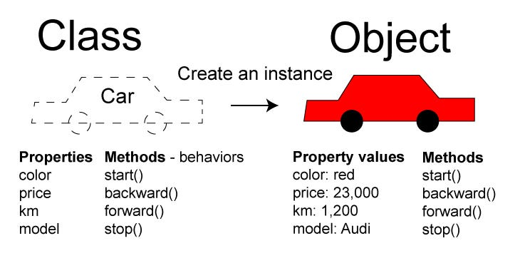

# Object Oriented Programming


## What is Object Oriented Programming?

Object Oriented Programming (OOP) is a programming paradigm that uses **objects** to represent **data** and **methods**.
It allows for the creation of **reusable code**, **encapsulation of data**, 
and **inheritance of properties** and **methods from other classes**.




## Key Concepts of OOP

### 1. Classes and Objects
- **Class**: A blueprint for creating objects. It defines properties and methods that the objects created from the class will have.
- **Object**: An instance of a class. It contains data and methods defined by the class.

### 2. Encapsulation

- Encapsulation is the bundling of data and methods that operate on that data within a single unit (class).
- It restricts direct access to some of an object's components, which can prevent the accidental modification of data.
- Encapsulation is achieved using access modifiers:
  - **Public**: Members are accessible from outside the class.
  - **Private**: Members are accessible only within the class.
  - **Protected**: Members are accessible within the class and by derived classes.

### 3. Inheritance
- Inheritance allows a class (child class) to inherit properties and methods from another class (parent class).
- It promotes code reusability and establishes a relationship between classes.

### 4. Polymorphism
- Polymorphism allows methods to do different things based on the object it is acting upon.
- It can be achieved through:
  - **Method Overloading**: Multiple methods with the same name but different parameters.

### 5. Abstraction
- Abstraction is the concept of hiding complex implementation details and showing only the essential features of an object.
- It can be achieved using abstract classes and interfaces.


## Benefits of Object-Oriented Programming:

- **Modularity**: Code is organized into classes, making it easier to manage and understand.
- **Reusability**: Classes can be reused across different programs, reducing redundancy.
- **Maintainability**: Changes in one part of the code can be made with minimal impact on other parts.
- **Scalability**: OOP allows for the creation of complex systems that can be easily extended.
- **Flexibility**: OOP allows for the creation of systems that can adapt to changing requirements.

## Create class and object :

```csharp
// Defining a class named Car
public class Car
{
	// Properties
	public string Make { get; set; } // Make of the car : get and set -> allows reading and writing
	public string Model { get; set; } 
	public int Year { get; set; }


	// Constructor initializes the properties
	public Car(string make, string model, int year) 
	{
		Make = make;  // Assigning values to properties
		Model = model;
		Year = year;
	}


	// Method
	public void DisplayInfo() // Method to display car information
	{
		Console.WriteLine($"Car: {Year} {Make} {Model}");
	}
}

// Creating an object of the Car class
// Creating an instance of the Car class with specific values
Car myCar = new Car("Toyota", "Corolla", 2020); 

// Calling the method

myCar.DisplayInfo(); // Output: Car: 2020 Toyota Corolla

```

## Class Constructors

A **constructor** is a special method that is called when an object of a class is created. It initializes the object's properties.

### Types of Constructors:
1. **Default Constructor**: A constructor that does not take any parameters. It initializes properties with default values.

**Example of Default Constructor:**
```csharp
public class Car
{
	public string Make { get; set; }
	public string Model { get; set; }
	public int Year { get; set; }
	// Default constructor
	public Car()
	{
		Make = "Unknown";
		Model = "Unknown";
		Year = 0;
	}
	public void DisplayInfo()
	{
		Console.WriteLine($"Car: {Year} {Make} {Model}");
	}
}

// Creating an object using the default constructor
Car myDefaultCar = new Car();
myDefaultCar.DisplayInfo(); // Output: Car: 0 Unknown Unknown
```
2. **Parameterized Constructor**: A constructor that takes parameters to initialize properties with specific values.

**Example of Parameterized Constructor:**
```csharp
public class Car
{
	public string Make { get; set; }
	public string Model { get; set; }
	public int Year { get; set; }
	// Parameterized constructor
	public Car(string make, string model, int year)
	{
		Make = make;
		Model = model;
		Year = year;
	}
	public void DisplayInfo()
	{
		Console.WriteLine($"Car: {Year} {Make} {Model}");
	}
}

// Creating an object using the parameterized constructor

Car myCar = new Car("Toyota", "Corolla", 2020);

myCar.DisplayInfo(); // Output: Car: 2020 Toyota Corolla
```

3. **Copy Constructor**: A constructor that creates a new object as a copy of an existing object.

**Example of Copy Constructor:**
```csharp

public class Car
{
	public string Make { get; set; }
	public string Model { get; set; }
	public int Year { get; set; }
	// Copy constructor
	public Car(Car existingCar)
	{
		Make = existingCar.Make;
		Model = existingCar.Model;
		Year = existingCar.Year;
	}
	public void DisplayInfo()
	{
		Console.WriteLine($"Car: {Year} {Make} {Model}");
	}
}

// Creating an object using the copy constructor

Car originalCar = new Car("Honda", "Civic", 2019);
Car copiedCar = new Car(originalCar);

copiedCar.DisplayInfo(); // Output: Car: 2019 Honda Civic
```

4. **Static Constructor**: A constructor that initializes static members of the class. It is called once, before any static members are accessed or any objects are created.

**Example of Static Constructor:**
```csharp

public class Car
{
	public static int TotalCars { get; private set; } // Static property to keep track of total cars
	public string Make { get; set; }
	public string Model { get; set; }
	public int Year { get; set; }
	// Static constructor
	static Car()
	{
		TotalCars = 0; // Initialize static property
	}
	// Parameterized constructor
	public Car(string make, string model, int year)
	{
		Make = make;
		Model = model;
		Year = year;
		TotalCars++; // Increment total cars when a new car is created
	}
	public void DisplayInfo()
	{
		Console.WriteLine($"Car: {Year} {Make} {Model}");
	}
}

// Creating objects of the Car class

Car car1 = new Car("Ford", "Mustang", 2021);
Car car2 = new Car("Chevrolet", "Camaro", 2022);

car1.DisplayInfo(); // Output: Car: 2021 Ford Mustang
car2.DisplayInfo(); // Output: Car: 2022 Chevrolet Camaro

Console.WriteLine($"Total Cars Created: {Car.TotalCars}"); // Output: Total Cars Created: 2
```

## Types of Attributes (Fields) :

Attributes are variables declared inside a class. They represent the state or data of an object. You can classify them
by:

### a. By Access Modifiers:

- **Public**: Accessible from anywhere.
- **Private**: Accessible only within the class.
- **Protected**: Accessible within the class and by derived classes.
- **Internal**: Accessible within the same assembly.
- **Protected Internal**: Accessible within the same assembly and by derived classes.

**Example of Access Modifiers:**
```csharp
public class Car
{
	public string Make { get; set; } // Public attribute
	private string Model { get; set; } // Private attribute
	protected int Year { get; set; } // Protected attribute
	internal string Color { get; set; } // Internal attribute
	protected internal string EngineType { get; set; } // Protected internal attribute
	
}
```
### b. By behavior:

- **Static**: Belongs to the class itself rather than to any specific object. It is shared among all instances of the class.
- **Instance**: Belongs to a specific object. Each instance of the class has its own copy of instance attributes.

**Example of Static and Instance Attributes:**
```csharp
public class Car
{
	public static int TotalCars { get; private set; } // Static attribute
	public string Make { get; set; } // Instance attribute
	public string Model { get; set; }
	public int Year { get; set; }
	// Constructor
	public Car(string make, string model, int year)
	{
		Make = make;
		Model = model;
		Year = year;
		TotalCars++; // Increment total cars when a new car is created
	}
}
```

## Type of Methods :
Methods are functions defined within a class that operate on the attributes of the class. They can be classified by:

### a. Instance Methods:
- Instance methods operate on instance attributes and can access both instance and static attributes.
- They require an instance of the class to be called.

**Example of Instance Method:**
```csharp

public class Car
{
	public string Make { get; set; }
	public string Model { get; set; }
	public int Year { get; set; }
	// Instance method
	public void DisplayInfo()
	{
		Console.WriteLine($"Car: {Year} {Make} {Model}");
	}
}

// Creating an object of the Car class
Car myCar = new Car { Make = "Toyota", Model = "Corolla", Year = 2020 };
myCar.DisplayInfo(); // Output: Car: 2020 Toyota Corolla
```
### b. Static Methods:
- Static methods operate on static attributes and can be called without creating an instance of the class.
- They are often used for utility functions or factory methods.
- They cannot access instance attributes directly.
- They can only access static attributes and methods.

**Example of Static Method:**
```csharp
public class Car
{
	public static int TotalCars { get; private set; } // Static attribute
	public string Make { get; set; }
	public string Model { get; set; }
	public int Year { get; set; }
	// Static method to get total cars created
	public static int GetTotalCars()
	{
		return TotalCars;
	}
	// Constructor
	public Car(string make, string model, int year)
	{
		Make = make;
		Model = model;
		Year = year;
		TotalCars++; // Increment total cars when a new car is created
	}
}

// Creating objects of the Car class
Car car1 = new Car("Ford", "Mustang", 2021);
Car car2 = new Car("Chevrolet", "Camaro", 2022);
Console.WriteLine($"Total Cars Created: {Car.GetTotalCars()}"); // Output: Total Cars Created: 2
```

### c. Accessor Methods:

Accessor methods are used to get or set the values of private attributes. They are often referred to as **getters** and **setters**.

- **Getter**: A method that retrieves the value of a private attribute.
- **Setter**: A method that sets the value of a private attribute.

**Example of Accessor Methods:**
```csharp
public class Car
{
	private string make; // Private attribute
	
	// Getter for Make
	public string GetMake()
	{
		return make;
	}
	// Setter for Make
	public void SetMake(string value)
	{
		make = value;
	}
	
}
```

### Or using properties :

Properties are a more concise way to define accessors in C#. They allow you to define getters and setters in a single line.

**Example of Properties:**
```csharp
public class Car
{
	public string Make { get; set; } // Auto-implemented property
	public string Model { get; set; }
	public int Year { get; set; }
	
	// Property with custom getter and setter
	private string color;
	public string Color
	{
		get { return color; }
		set { color = value; }
	}
}

// Creating an object of the Car class

Car myCar = new Car
{
	Make = "Toyota",
	Model = "Corolla",
	Year = 2020,
	Color = "Red"
};

Console.WriteLine($"Car: {myCar.Year} {myCar.Make} {myCar.Model}, Color: {myCar.Color}");
// Output: Car: 2020 Toyota Corolla, Color: Red
```

## Why Use Properties?

- Control how values are accessed or modified.
- Apply validation logic in set.
- Allow read-only or write-only access.
- Hide internal data structures.

## Types of Properties

### 1. Auto-Implemented Properties:
Auto-implemented properties are a shorthand way to define properties without explicitly declaring a backing field. The compiler automatically creates a private field for you.

**Example of Auto-Implemented Property:**

```csharp
public class Car
{
	public string Make { get; set; } // Auto-implemented property
	
}
```


### 2. Read-Only Properties:
Read-only properties allow you to define a property that can only be read, not modified. They are useful for exposing calculated values or constants.


**Example of Read-Only Property:**
```csharp
public class Car
{
	private string make; // Private backing field for Make property
	
	// Read-only property
	public string Make
	{
		get { return make; }
	}
	
	
}
```
### 3. Write-Only Properties:

Write-only properties allow you to define a property that can only be set, not read. They are less common but can be useful in certain scenarios.

**Example of Write-Only Property:**
```csharp
public class Car
{
	private string make; // Private backing field for Make property
	
	// Write-only property
	public string Make
	{
		set { make = value; }
	}
	

```


### 4. Property with Validation Logic:

You can add validation logic in the setter of a property to ensure that only valid values are assigned.

**Example of Property with Validation Logic:**

```csharp
public class Car
{
	private string make;
	public string Make
	{
		get { return make; }
		set
		{
			if (string.IsNullOrEmpty(value))
			{
				throw new ArgumentException("Make cannot be null or empty.");
			}
			make = value;
		}
	}
	
	

```

### d. Constructor Methods:

Constructor methods are special methods that are called when an object of a class is created. They are used to initialize the object's attributes.

**Example of Constructor Method:**
```csharp

public class Car
{
	public string Make { get; set; }

	
	// Constructor method
	public Car(string make)
	{
		Make = make;
		
	}
}
```

### e. Destructor Methods:

Destructor methods are special methods that are called when an object is about to be destroyed. They are used to clean up resources or perform any necessary finalization.

**Example of Destructor Method:**
```csharp

public class Car
{
	public string Make { get; set; }
	
	// Destructor method
	~Car()
	{
		// Cleanup code here
		Console.WriteLine("Car object is being destroyed.");
	}
}
```

